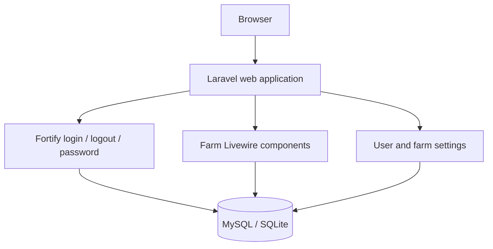
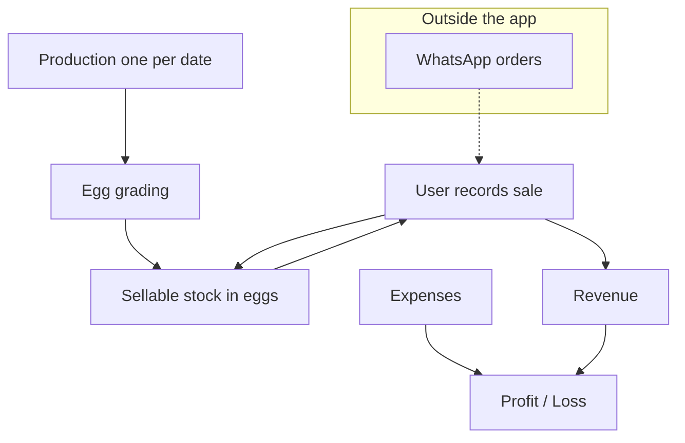

# Architecture

## Documentation Status

Updated September 2026. Reflects the architecture of the **Laravel 13 + Livewire 4 + Flux UI + Blade + Tailwind CSS 4** application. Base starter-kit authentication and settings are present, while farm domain models and features are planned for implementation.

Related: [SRS](SRS.md) · [Database](DATABASE.md) · [Business Rules](BUSINESS-RULES.md) · [Decisions](DECISIONS.md)

## Overview

Laravel 13 monolith with Livewire 4, Flux UI, Blade templates, and Tailwind CSS 4. The browser interacts via standard web requests and reactive Livewire components (no `routes/api.php`). MySQL is configured in `.env.example`. Tests use SQLite in memory with Pest.

Application timezone is **Asia/Kuala_Lumpur**. Business-date grouping (today, this week, this month, daily records) uses that timezone via `App\Support\BusinessDate`. Database timestamps follow standard Laravel conventions.

There is **no** WhatsApp, payment, or server-side PDF integration. Report pages use the browser print dialog.



Farm data flow:



## Application Layers

| Layer | Location |
| --- | --- |
| Routes | `routes/web.php`, `routes/settings.php`, Fortify |
| Livewire & Controllers | `app/Livewire/` components, `resources/views/pages/`, `app/Http/Controllers/` |
| Models | `App\Models\` |
| Enums | `App\Enums\SaleUnit`, `App\Enums\AdjustmentType` |
| Services | `App\Services\StockService`, `App\Services\ProfitLossService` |
| Dates | `App\Support\BusinessDate` |
| Views & UI | `resources/views/` (Blade, layouts, Flux UI `<flux:*>`) |
| Console schedule | Starter `inspire` only |

`StockService` will be the source of truth for available stock, tray normalization, overselling checks, and grading-mismatch messages. Livewire components do not keep a stored running balance.

## Main Modules

### Authentication

Fortify, `web` guard, sessions. Login, logout, and change password are active in the starter kit. Registration, password reset, 2FA, and passkeys are disabled or planned for removal to match private farm requirements.

| Action | Route | Status |
| --- | --- | --- |
| Home | `GET /` | Redirects to login or dashboard |
| Login / logout | `/login`, `POST /logout` | Starter Kit |
| Register | `/register` | To be disabled |
| Password reset | `/forgot-password` | To be disabled |
| 2FA / passkeys | `/two-factor-challenge`, `/passkeys/*` | To be disabled |
| Change password | `/settings/security` | Starter Kit |
| Health | `GET /up` | Implemented |

Login is rate-limited to 5 attempts per minute per email+IP.

### Dashboard

`GET /dashboard`, middleware `auth`. Shows summaries: production today/month, grading today, stock by grade, sales today/month, expenses this month, P&L this month using Flux UI stat/card components.

### User and farm settings

Profile (name/email), security (password only), appearance (dark/light/system), farm tray size (`/settings/farm`).

### Farm modules (Planned)

| Module | Routes / Livewire | Notes |
| --- | --- | --- |
| Production | `productions.*` | One record per date |
| Grades | `egg-grades.*` | Deactivate if used |
| Grading | `egg-gradings.*` | Warns on mismatch, still saves |
| Stock | `stock` | Snapshot from `StockService` |
| Adjustments | `stock-adjustments.*` | Reason required |
| Customers | `customers.*` | Optional on sales |
| Sales | `sales.*` | Tray or egg integers |
| Expenses | `expenses.*` | Seeded categories |
| Profit / loss | `profit-loss` | Period filters |
| Reports | `reports.*` | Browser print |

Sidebar (Flux Navlist): Dashboard, Production, Grading, Stock, Customers, Sales, Expenses, Profit / Loss, Reports, Grades.

## Data Flow

```text
Browser → web middleware (session, CSRF)
  → auth middleware
  → Livewire component action
  → StockService / ProfitLossService when stock or P&L is involved
  → Eloquent models → MySQL / SQLite
  → Reactive Blade render with Flux UI
```

Shared layouts: `resources/views/layouts/auth.blade.php` for login; `resources/views/layouts/app/sidebar.blade.php` for authenticated app pages.

```text
Production (collection only; one row per date)
  → Egg grading (eggs per configurable grade)
  → Sellable stock (calculated)
  → Sale (Tray or Egg integer qty) → normalized eggs deducted → full total to revenue

Expenses → Profit / Loss = revenue − expenses
```

WhatsApp is not a system input.

## Stock Update Flow

1. **No** stock balance column as source of truth.
2. Available eggs for a grade = graded − sold normalized eggs ± adjustments (`StockService::availableEggs`).
3. Tray sales convert with **current** `eggs_per_tray`, then persist `normalized_egg_quantity`.
4. Quantity must be a positive integer for both tray and egg units.
5. Oversell → validation error, no row written.
6. Edit/delete of grading, sale, or adjustment recalculates from remaining rows.
7. Block grading/adjustment deletes that would make available stock negative.
8. Production create/edit/delete does not touch stock.
9. Grading vs expected gradable eggs mismatch flashes a **warning** after save; it does not block and does not rewrite either record.

Details: [Business Rules](BUSINESS-RULES.md).

## Profit/Loss Flow

`App\Services\ProfitLossService`:

```text
Revenue = SUM(sales.total_amount) in period
Expenses = SUM(expenses.amount) in period
Net = Revenue − Expenses
```

Periods use `BusinessDate` in `Asia/Kuala_Lumpur`. No payment collection.

## Error Handling

- Livewire component validation → Flux `<flux:error />` and validation messages
- Success and grading-mismatch notifications via Flux UI toasts (`Flux::toast()`)
- Guests hitting farm routes → redirect to login
- Farm validation: unique production date, integer quantities, overselling, negative quantities, missing adjustment reason, grading-delete stock guard
- Grading mismatch: warning after save, not a validation block

## Security

| Control | Status |
| --- | --- |
| Session auth, CSRF, hashed passwords | Implemented |
| Production password rules (12+ mixed, uncompromised) | Implemented in `AppServiceProvider` |
| Login throttling | Implemented |
| Roles / policies | Not used (single access level) |
| Public registration | To be disabled |
| Email verification | Not used |
| HTTPS | Production requirement only |
| Destructive DB commands blocked in production | Implemented |
| WhatsApp / payment secrets | None — no integrations |

