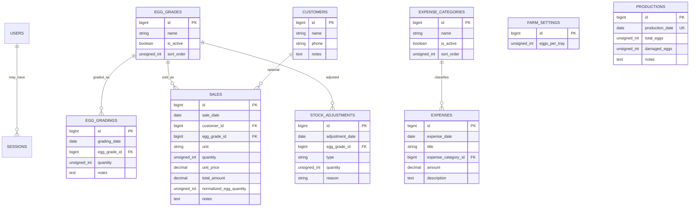

# Database Design

## Documentation Status

Updated September 2026. Defines the database schema specifications for the farm domain. Current repository migrations contain the base starter kit tables (`users`, `cache`, `jobs`), while farm tables (`farm_settings`, `egg_grades`, `productions`, `egg_gradings`, `customers`, `sales`, `stock_adjustments`, `expense_categories`, `expenses`) and seeders are planned for implementation.

Related: [Architecture](ARCHITECTURE.md) · [Business Rules](BUSINESS-RULES.md) · [Decisions](DECISIONS.md)

## Overview

`config/database.php` defaults to SQLite if `DB_CONNECTION` is unset. `.env.example` sets **MySQL**:

- `DB_CONNECTION=mysql`
- `DB_HOST=127.0.0.1`
- `DB_PORT=3306`
- `DB_DATABASE=ems`

Tests use SQLite in memory with Pest (`phpunit.xml`).

Farm tables will be created by planned domain migrations (`create_farm_domain_tables.php`).

Business dates are stored as `date` columns and interpreted in **Asia/Kuala_Lumpur**. Created/updated timestamps follow Laravel defaults.

## ERD



`PRODUCTIONS` has no FK to stock: production does not increase inventory.

A single `sales` row per grade/unit is enough for v1. A `sales` + `sale_items` split is not used.

Framework tables `password_reset_tokens`, `cache`, `cache_locks`, `jobs`, `job_batches`, `failed_jobs`, and leftover `passkeys` are omitted from the diagram. Passkey and password-reset tables remain from the starter kit but the matching Fortify features are disabled.

## Tables

### `users`

Model: `App\Models\User`.

| Column | Type | Nullable | Description |
| --- | --- | --- | --- |
| `id` | bigint PK | No | Primary key |
| `name` | string | No | Display name |
| `email` | string | No | Unique login identifier |
| `email_verified_at` | timestamp | Yes | Set by factory; email verification is not enforced |
| `password` | string | No | Hashed |
| `two_factor_secret` | text | Yes | Unused leftover column |
| `two_factor_recovery_codes` | text | Yes | Unused leftover column |
| `two_factor_confirmed_at` | timestamp | Yes | Unused leftover column |
| `remember_token` | string | Yes | Remember-me token |
| `created_at` / `updated_at` | timestamp | Yes | |

Unique: `email`. Migrations: `0001_01_01_000000_create_users_table.php`, `2025_08_14_170933_add_two_factor_columns_to_users_table.php`.

### `farm_settings`

Single-row setting. Model: `App\Models\FarmSetting`.

| Column | Type | Nullable | Description |
| --- | --- | --- | --- |
| `id` | bigint PK | No | |
| `eggs_per_tray` | unsigned int | No | Default 30. Used when saving **new** tray sales and for **display** conversion. Never rewrite historical `normalized_egg_quantity`. |
| timestamps | | | |

Do not put `30` in PHP/Blade conditionals except as the seed/default.

### `egg_grades`

Seed Grade AA through Grade F with their standard weight ranges. Users can rename, add, edit, deactivate, reactivate.

| Column | Type | Nullable | Description |
| --- | --- | --- | --- |
| `id` | bigint PK | No | Stable reference for history |
| `name` | string | No | Display name (not hardcoded in application logic) |
| `is_active` | boolean | No | Inactive grades cannot be chosen on **new** records |
| `weight_range` | varchar, nullable | Yes | Display description such as `55–59.9 g` |
| `sort_order` | unsigned int | No | Form/list order |
| timestamps | | | |

Do not hard-delete a grade that is referenced; the controller deactivates it instead. Historical rows keep `egg_grade_id` and therefore show the **current** name after a rename. No duplicate grade label is stored on sales or grading rows.

### `productions`

| Column | Type | Nullable | Description |
| --- | --- | --- | --- |
| `id` | bigint PK | No | |
| `production_date` | date | No | **Unique** — one record per calendar date |
| `total_eggs` | unsigned int | No | Combined daily collection |
| `damaged_eggs` | unsigned int | No | Default 0 |
| `notes` | text | Yes | |
| timestamps | | | |

No stock side effects. Expected gradable eggs = `total_eggs − damaged_eggs`.

### `egg_gradings`

| Column | Type | Nullable | Description |
| --- | --- | --- | --- |
| `id` | bigint PK | No | |
| `grading_date` | date | No | Indexed |
| `egg_grade_id` | bigint FK | No | `restrictOnDelete` |
| `quantity` | unsigned int | No | Individual eggs |
| `notes` | text | Yes | |
| timestamps | | | |

### `customers`

| Column | Type | Nullable | Description |
| --- | --- | --- | --- |
| `id` | bigint PK | No | |
| `name` | string | No | |
| `phone` | string | Yes | |
| `notes` | text | Yes | |
| timestamps | | | |

No address column in v1.

### `sales`

| Column | Type | Nullable | Description |
| --- | --- | --- | --- |
| `id` | bigint PK | No | |
| `sale_date` | date | No | Indexed |
| `customer_id` | bigint FK | Yes | Null = no customer; **`nullOnDelete`** |
| `egg_grade_id` | bigint FK | No | `restrictOnDelete` |
| `unit` | string | No | `tray` or `egg` |
| `quantity` | unsigned int | No | Whole trays or eggs; must be > 0 |
| `unit_price` | decimal(10,2) | No | Price per tray or per egg |
| `total_amount` | decimal(10,2) | No | `quantity × unit_price` |
| `normalized_egg_quantity` | unsigned int | No | Eggs at save time; source for stock |
| `notes` | text | Yes | |
| timestamps | | | |

No `payment_status`, `amount_paid`, or `balance`.

Indexes: `sale_date`, `egg_grade_id`.

### `stock_adjustments`

| Column | Type | Nullable | Description |
| --- | --- | --- | --- |
| `id` | bigint PK | No | |
| `adjustment_date` | date | No | Indexed |
| `egg_grade_id` | bigint FK | No | `restrictOnDelete` |
| `type` | string | No | `add` or `remove` |
| `quantity` | unsigned int | No | Eggs; > 0 |
| `reason` | string | No | Required |
| timestamps | | | |

### Expenses

`expense_categories`: name, `is_active`, `sort_order`. Seed Feed, Transport, Packaging, Utilities, Labour, Maintenance, Other.

`expenses`: `expense_date` (indexed), `title`, `expense_category_id` (`restrictOnDelete`), `amount` (decimal > 0), `description` nullable.

## Relationships and integrity

- Sale → customer: nullable, **ON DELETE SET NULL**. Sales remain after a customer is deleted.
- Sale / grading / adjustment → egg grade: **ON DELETE RESTRICT**. Used grades are deactivated in the application instead of deleted.
- Expense → category: **ON DELETE RESTRICT**.
- Sessions are not FK-constrained.
- There is no stored stock-balance table. Available eggs are derived from:

```text
egg_gradings.quantity
− sales.normalized_egg_quantity
± stock_adjustments quantities
```

See [ADR-003](DECISIONS.md#adr-003-transaction-derived-stock).

## Seed data
 
A planned `FarmSeeder` will create:
 
- `farm_settings.eggs_per_tray = 30`
- Grade AA through Grade F, including their weight ranges
- Expense categories listed above
 
`DatabaseSeeder` provides base development setup and local test user configuration.
